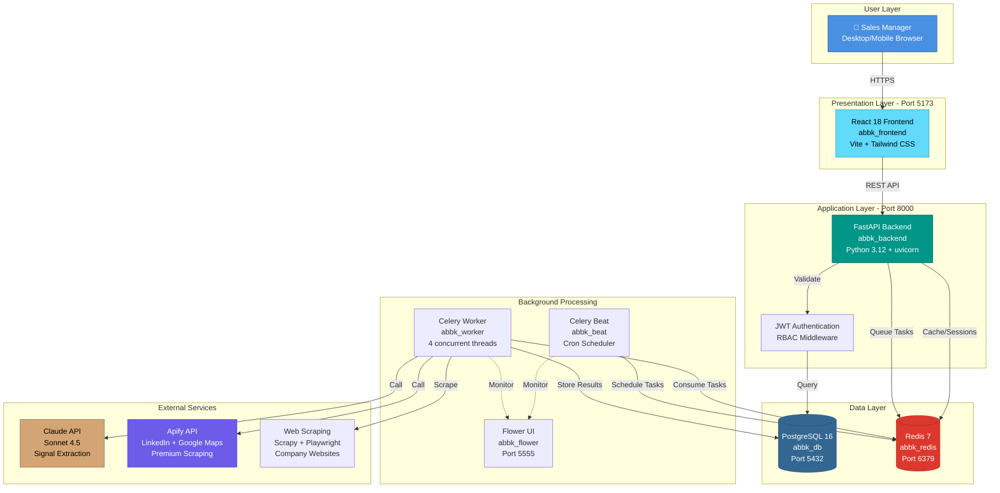
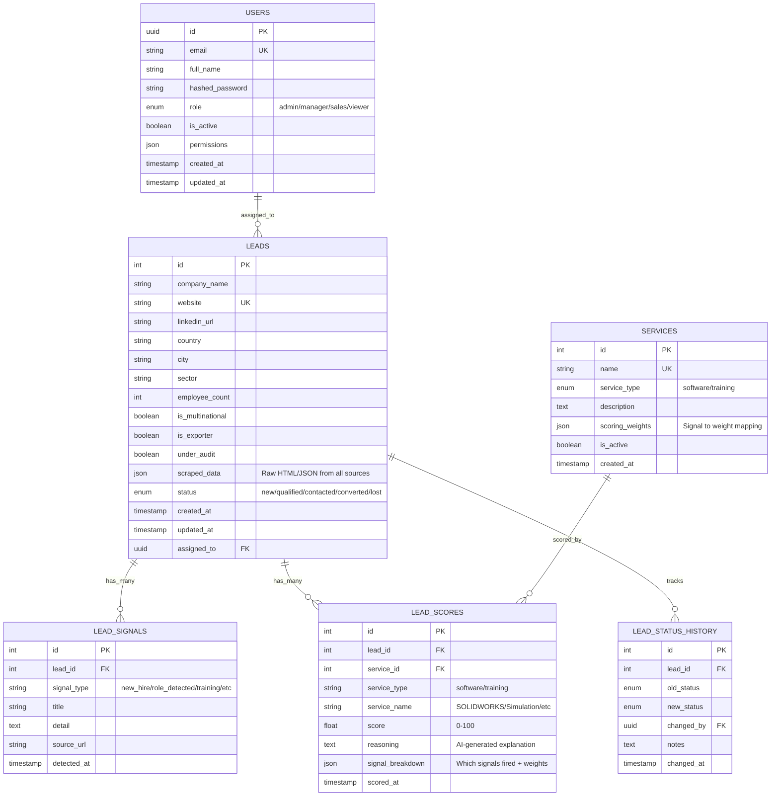
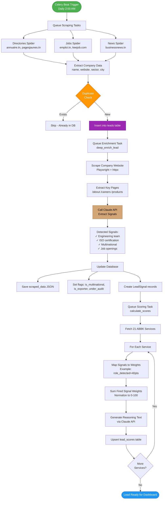
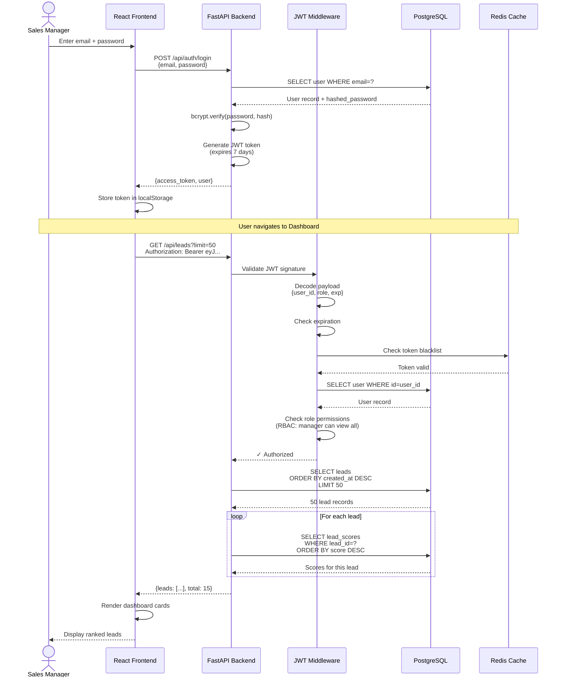
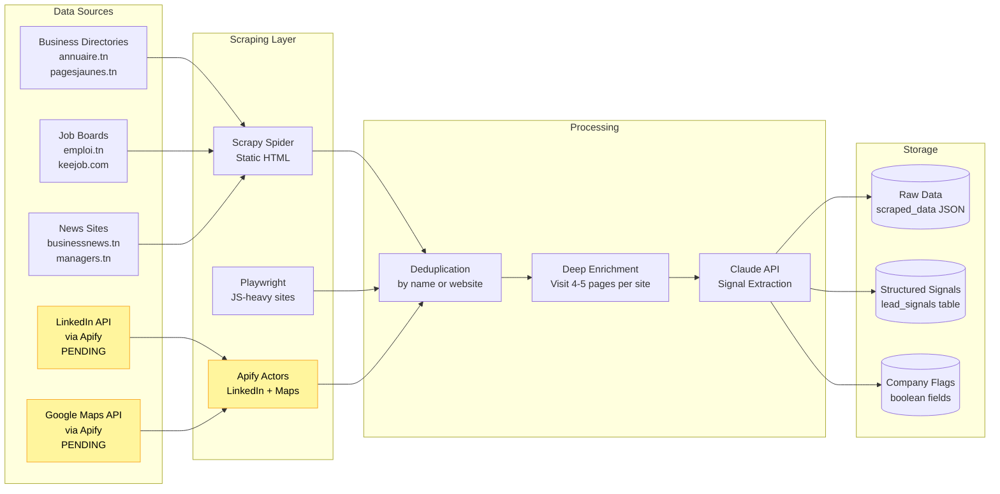
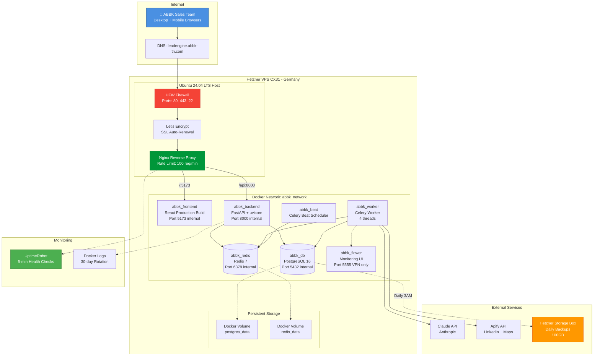
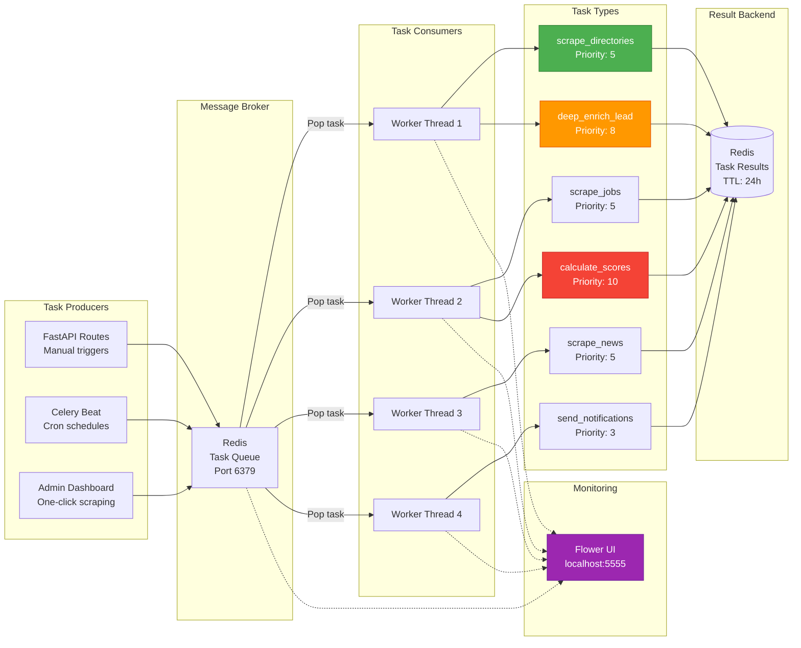
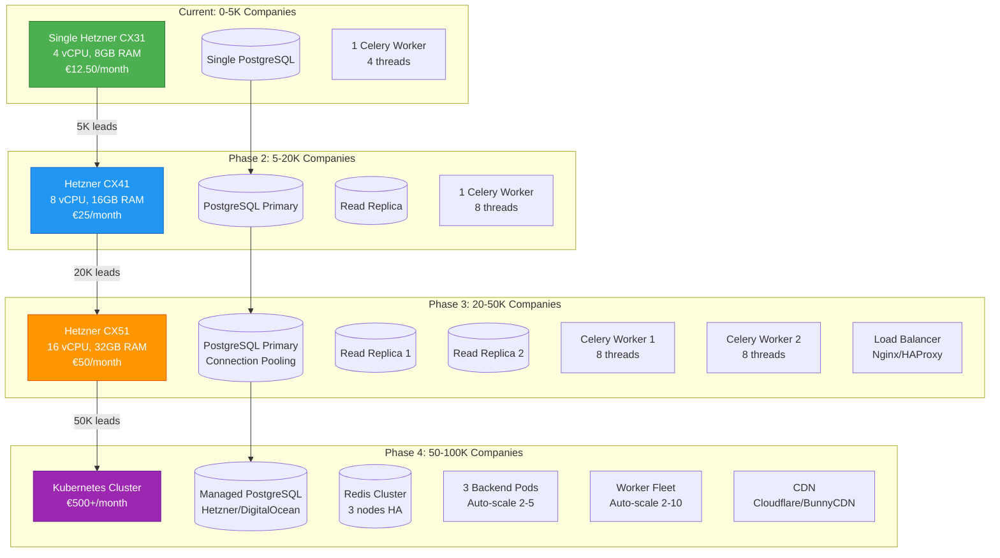

# ABBK LeadEngine - Architecture Diagrams

**View these diagrams:**
- GitHub/GitLab: Renders automatically in markdown
- VS Code: Install "Markdown Preview Mermaid Support" extension
- Online: Copy diagram code to https://mermaid.live
- Export: Use mermaid.live to export as PNG/SVG/PDF

---

## 1. System Architecture Overview



---

## 2. Database Schema (ER Diagram)



---

## 3. Data Flow - Lead Discovery to Scoring



---

## 4. API Request Flow with Authentication



---

## 5. Scraping and Enrichment Pipeline



---

## 6. Scoring Engine Architecture

```mermaid
flowchart TD
    START[Lead Enrichment Complete] --> FETCH[Fetch Lead + All Signals]
    
    FETCH --> SERVICES[Load 21 ABBK Services]
    
    SERVICES --> LOOP_START{For Each Service}
    
    LOOP_START -->|SOLIDWORKS Standard| SW1[Scoring Weights:<br/>role_detected: 35pts<br/>logo_detected: 25pts<br/>new_hire: 20pts<br/>is_multinational: 15pts<br/>under_audit: 5pts]
    
    LOOP_START -->|SOLIDWORKS Simulation| SW2[Scoring Weights:<br/>role_detected: 40pts<br/>logo_detected: 30pts<br/>is_multinational: 15pts<br/>under_audit: 10pts<br/>new_hire: 5pts]
    
    LOOP_START -->|SOLIDWORKS Electrical| SW3[Scoring Weights:<br/>role_electrical: 40pts<br/>logo_detected: 30pts<br/>new_hire: 15pts<br/>is_multinational: 10pts<br/>under_audit: 5pts]
    
    SW1 --> MAP1[Map Detected Signals<br/>to Weights]
    SW2 --> MAP1
    SW3 --> MAP1
    
    MAP1 --> SUM[Sum Weights<br/>Example: 35+25+15 = 75pts]
    
    SUM --> NORMALIZE[Normalize to 0-100<br/>Score = 75/100 * 100 = 75]
    
    NORMALIZE --> CLASSIFY{Classify Score}
    
    CLASSIFY -->|70-100| HOT[🔥 HOT LEAD<br/>Call Today]
    CLASSIFY -->|60-69| WARM[🔶 WARM<br/>Call This Week]
    CLASSIFY -->|30-59| POTENTIAL[📋 POTENTIAL<br/>Add to Pipeline]
    CLASSIFY -->|0-29| RESEARCH[🔍 RESEARCH<br/>Gather More Data]
    
    HOT --> REASONING[Generate Reasoning Text<br/>via Claude API]
    WARM --> REASONING
    POTENTIAL --> REASONING
    RESEARCH --> REASONING
    
    REASONING --> SAVE[Save to lead_scores<br/>UPSERT by (lead_id, service_name)]
    
    SAVE --> LOOP_END{More Services?}
    LOOP_END -->|Yes| LOOP_START
    LOOP_END -->|No| DASHBOARD[Lead Appears in Dashboard<br/>Ranked by Best Score]
    
    style HOT fill:#F44336,stroke:#C62828,color:#fff
    style WARM fill:#FF9800,stroke:#E65100,color:#fff
    style POTENTIAL fill:#2196F3,stroke:#1565C0,color:#fff
    style RESEARCH fill:#9E9E9E,stroke:#616161,color:#fff
    style DASHBOARD fill:#4CAF50,stroke:#2E7D32,color:#fff
```

---

## 7. Production Deployment Architecture



---

## 8. Celery Task Queue Architecture



---

## 9. RBAC (Role-Based Access Control)

```mermaid
flowchart TD
    START[User Login] --> AUTH{JWT Valid?}
    AUTH -->|No| REJECT[❌ 401 Unauthorized]
    AUTH -->|Yes| DECODE[Decode JWT Payload<br/>{user_id, role, exp}]
    
    DECODE --> CHECK_ROLE{Check Role}
    
    CHECK_ROLE -->|admin| ADMIN_PERMS[✅ Full Access<br/>+ User Management<br/>+ RBAC Control<br/>+ All Leads<br/>+ All Scores]
    
    CHECK_ROLE -->|manager| MANAGER_PERMS[✅ All Leads<br/>✅ All Scores<br/>✅ Reports<br/>✅ Dashboard<br/>❌ User Management]
    
    CHECK_ROLE -->|sales| SALES_PERMS[✅ Assigned Leads Only<br/>✅ Their Scores<br/>❌ Other Users' Data<br/>❌ Reports]
    
    CHECK_ROLE -->|viewer| VIEWER_PERMS[✅ Read-Only Access<br/>❌ No Scores Visible<br/>❌ No Editing<br/>❌ No Reports]
    
    ADMIN_PERMS --> ENDPOINT{Requested Endpoint}
    MANAGER_PERMS --> ENDPOINT
    SALES_PERMS --> ENDPOINT
    VIEWER_PERMS --> ENDPOINT
    
    ENDPOINT -->|GET /api/leads| CHECK_LEADS{Check Permission}
    ENDPOINT -->|POST /api/users| CHECK_USERS{Admin Only}
    ENDPOINT -->|GET /api/scores| CHECK_SCORES{Check Permission}
    
    CHECK_LEADS -->|admin/manager| ALLOW_ALL[Return All Leads]
    CHECK_LEADS -->|sales| FILTER[Return Assigned Leads<br/>WHERE assigned_to=user_id]
    CHECK_LEADS -->|viewer| ALLOW_READONLY[Return All Leads<br/>No Edit Allowed]
    
    CHECK_USERS -->|admin| ALLOW_MGMT[✅ Allow User CRUD]
    CHECK_USERS -->|Others| FORBID[❌ 403 Forbidden]
    
    CHECK_SCORES -->|admin/manager| ALLOW_SCORES[✅ Return Scores]
    CHECK_SCORES -->|sales| FILTER_SCORES[Return Scores<br/>for Assigned Leads Only]
    CHECK_SCORES -->|viewer| HIDE_SCORES[❌ 403 Forbidden]
    
    style ADMIN_PERMS fill:#4CAF50,stroke:#2E7D32,color:#fff
    style MANAGER_PERMS fill:#2196F3,stroke:#1565C0,color:#fff
    style SALES_PERMS fill:#FF9800,stroke:#E65100,color:#fff
    style VIEWER_PERMS fill:#9E9E9E,stroke:#616161,color:#fff
    style FORBID fill:#F44336,stroke:#C62828,color:#fff
```

---

## 10. Scaling Path (0 → 100K Companies)



---

## How to Use These Diagrams

### View in VS Code
1. Install extension: "Markdown Preview Mermaid Support"
2. Open this file
3. Press `Ctrl+Shift+V` (Windows/Linux) or `Cmd+Shift+V` (Mac)
4. Diagrams render automatically

### Export as Images
1. Copy diagram code
2. Go to https://mermaid.live
3. Paste code in left panel
4. Click "Actions" → Download PNG/SVG/PDF

### Embed in Presentations
1. Export as SVG (vector, scales perfectly)
2. Import into PowerPoint/Google Slides/Keynote
3. Or use PNG for simpler workflows

### GitHub/GitLab
- Diagrams render automatically in markdown preview
- No installation needed
- Perfect for documentation

---

**Created:** July 13, 2026  
**Last Updated:** July 13, 2026  
**Version:** 1.0
